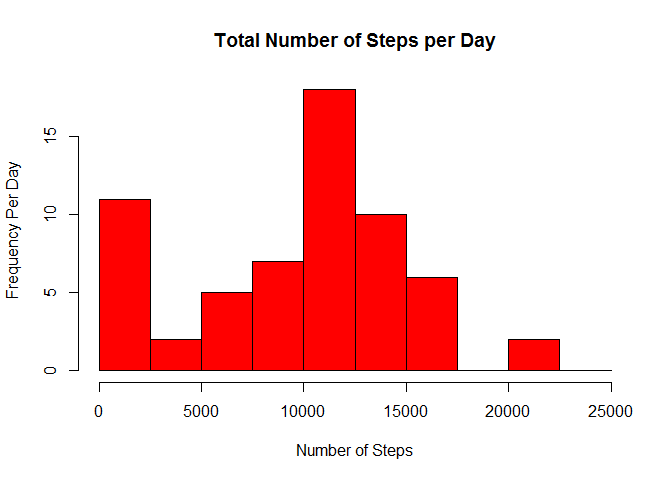
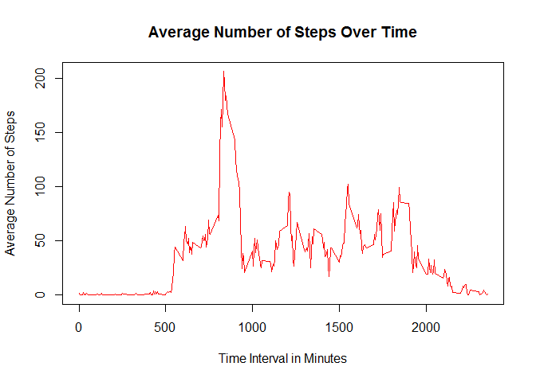
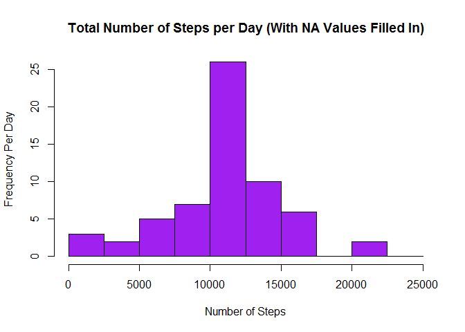
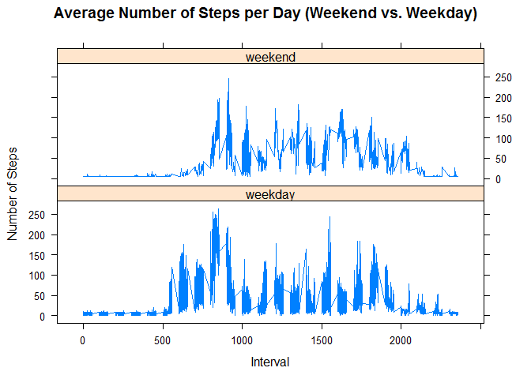

# Reproducible Research Course Project 1
Courtney Mitchell  
April 2, 2016  
###Intro

This is an R Markdown document for the first course project in the Data Science course on Reproducible Research.

This assignment makes use of data from a personal activity monitoring device. This device collects data at 5 minute intervals through out the day. The data consists of two months of data from an anonymous individual collected during the months of October and November, 2012 and include the number of steps taken in 5 minute intervals each day.

The data for this assignment was forked from the original github repository https://github.com/rdpeng/RepData_PeerAssessment1


###Getting Started - Prepping the Workspace

Before we begin to analyze the data we need to prep the workspace in R.

First we load the 'knitr' package and make sure to set the **ECHO** to **TRUE**, so that the code will be visible, and set **results** to **hold**

```r
library(knitr)
opts_chunk$set(echo = TRUE, results = 'hold')
```

Then we load the other library we will use, 'data.table' 

```r
library(data.table)
```

###Prepping the Data
Now we're going to load and preprocess the dataset 'activity.csv'


```r
stepdata <- read.csv('activity.csv', header = TRUE, sep = ",", colClasses = c("numeric", "character", "numeric"))
```
***Note: this line of code assumes the .csv file is already in the working directory***

Next we process the data to have a usable date format, compute the weekdays, create a type column, and build the data frame we will use.

```r
## compute date
stepdata$date <- as.POSIXct(stepdata$date, format = "%Y-%m-%d")

## compute weekdays
stepdata <- data.frame(date=stepdata$date, weekday=tolower(weekdays(stepdata$date)), steps=stepdata$steps, interval=stepdata$interval)

##compute type (weekend or weekday)
stepdata <- cbind(stepdata, type=ifelse(stepdata$weekday == "saturday" |
                                          stepdata$weekday == "sunday", "weekend", "weekday"))
##build data frame
stepdata <- data.frame(date=stepdata$date, weekday=stepdata$weekday, type=stepdata$type, interval=stepdata$interval, steps=stepdata$steps)

##show header
head(stepdata)
```

```
##         date weekday    type interval steps
## 1 2012-10-01  monday weekday        0    NA
## 2 2012-10-01  monday weekday        5    NA
## 3 2012-10-01  monday weekday       10    NA
## 4 2012-10-01  monday weekday       15    NA
## 5 2012-10-01  monday weekday       20    NA
## 6 2012-10-01  monday weekday       25    NA
```

###Question 1 - What is the mean total number of steps taken per day?
For this question we will ignore NA values


```r
##compute total number of steps per day
totalsteps <- aggregate(stepdata$steps, by=list(stepdata$date), FUN = sum, na.rm = TRUE)

##rename attributes to "total" and "date"
names(totalsteps) <- c("date", "total")

##show header
head(totalsteps)
```

```
##         date total
## 1 2012-10-01     0
## 2 2012-10-02   126
## 3 2012-10-03 11352
## 4 2012-10-04 12116
## 5 2012-10-05 13294
## 6 2012-10-06 15420
```
Now we will build a histogram plot


```r
hist(totalsteps$total, breaks = seq(from = 0, to = 25000, by = 2500), col = "red", main = "Total Number of Steps per Day", xlab = "Number of Steps", ylab = "Frequency Per Day")
```



Next we will compute the ***mean*** and ***median*** steps per day


```r
stepmean <- mean(totalsteps$total)
stepmedian <- median(totalsteps$total)
```
The mean number of steps per day is **9354.23** and the median is **10395**.

###Question 2 - What is the average daily activity pattern?
We'll use the aggregate function again for this question


```r
##take the average number of steps by interval 
avgstep <- aggregate(stepdata$steps, by = list(stepdata$interval), FUN = mean, na.rm = TRUE)

##rename attributes to "mean" and "interval"
names(avgstep) <- c("interval", "mean")

##show header
head(avgstep)
```

```
##   interval      mean
## 1        0 1.7169811
## 2        5 0.3396226
## 3       10 0.1320755
## 4       15 0.1509434
## 5       20 0.0754717
## 6       25 2.0943396
```
Now we create a time series plot, aka a line graph.


```r
plot(avgstep$interval, avgstep$mean, type = "l", col = "red", main = "Average Number of Steps Over Time", xlab = "Time Interval in Minutes", ylab = "Average Number of Steps")
```



So, which 5-minute interval, on average across all the days in the dataset, contains the maximum number of steps?
To answer this question we find the interval with the maximum mean.


```r
##find max mean
maxmean <- which(avgstep$mean == max(avgstep$mean))

##find interval
maxint <- avgstep[maxmean, 1]
```
The **835th** minute interval contains the highest number of steps on average.

###Question 3 - What about missing values?
There are a number of days in the data set with missing values, which can introduce bias into the analysis. How do we account for these values?

First we need to calculate the number of missing values in the dataset

```r
##use a simple sum here
natotal <- sum(is.na(stepdata$steps))
```
The total number of NA values is **2304**.

Now, we need to devise a plan to fill in the null values. For this exercise we will add the mean number of steps for the NA interval across the date range.


```r
##first find the position of the NAs (like with max mean)
naposition <- which(is.na(stepdata$steps))
##then create mean vector
namean <- rep(mean(stepdata$steps, na.rm = TRUE), times = length(naposition))
```

Now we will create a new data frame that includes the filled in values


```r
stepdata[naposition, "steps"] <- namean

##display header
head(stepdata)
```

```
##         date weekday    type interval   steps
## 1 2012-10-01  monday weekday        0 37.3826
## 2 2012-10-01  monday weekday        5 37.3826
## 3 2012-10-01  monday weekday       10 37.3826
## 4 2012-10-01  monday weekday       15 37.3826
## 5 2012-10-01  monday weekday       20 37.3826
## 6 2012-10-01  monday weekday       25 37.3826
```
Now let's graph it out


```r
##we're basically repeating the same process we did with the original data set
##compute total number of steps per day (no need to set NAs)
totalsteps <- aggregate(stepdata$steps, by=list(stepdata$date), FUN = sum)

##rename attributes to "total" and "date"
names(totalsteps) <- c("date", "total")

##create histogram
hist(totalsteps$total, breaks = seq(from = 0, to = 25000, by = 2500), col = "purple", main = "Total Number of Steps per Day (With NA Values Filled In)", xlab = "Number of Steps", ylab = "Frequency Per Day")
```



What are the new mean and median?

```r
step2mean <- mean(totalsteps$total)
step2median <- median(totalsteps$total)
```
With the NA values filled in, the new values for both the mean and median is **10766.19**.

By adding the mean value for the NAs, we've changed the data considerably. The mean and median are much larger than in our original graph. This makes sense, however, in that we have artifically added more data (and data with larger values) to our dataset. Therefore, it makes sense for the mean and median to increase.

###Question 4 - Are there differences in activity patterns between weekdays and weekends?
To answer this question we will use the 'type' column we created previously.

For this graph, we will load the lattice package

```r
library(lattice)

##compute the average number of steps across the 'type' variable
avgstep2 <- aggregate(stepdata$steps, by = list(stepdata$type, stepdata$weekday, stepdata$interval), mean)

##rename attributes to "type", "weekday", "interval", and "mean"
names(avgstep2) <- c("type", "weekday", "interval", "mean")

##display header
head(avgstep2)
```

```
##      type  weekday interval     mean
## 1 weekday   friday        0 8.307244
## 2 weekday   monday        0 9.418355
## 3 weekend saturday        0 4.672825
## 4 weekend   sunday        0 4.672825
## 5 weekday thursday        0 9.375844
## 6 weekday  tuesday        0 0.000000
```


```r
xyplot(mean ~ interval | type, avgstep2, type = "l", main = "Average Number of Steps per Day (Weekend vs. Weekday)", xlab = "Interval", ylab = "Number of Steps", layout = c(1,2))
```



These graphs show a difference in activity levels on weekdays versus the weekend. On weekdays, there is a significant burst of activity at the beginning of the day that is not present on the weekends. Presumably, people are sleeping in. 
